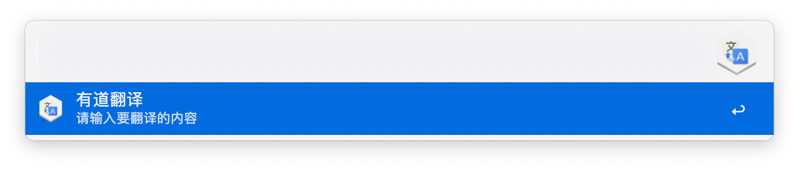
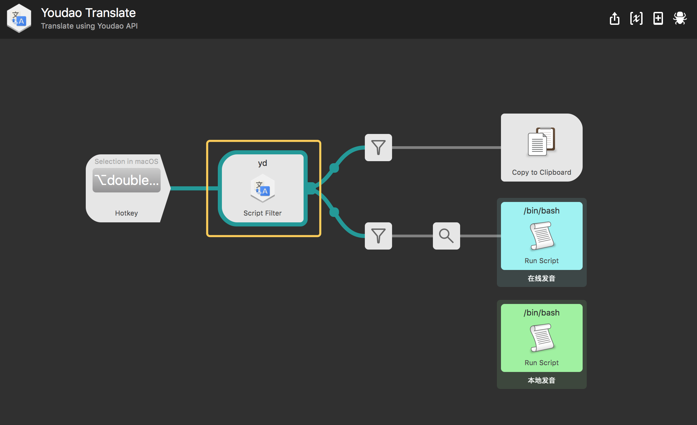
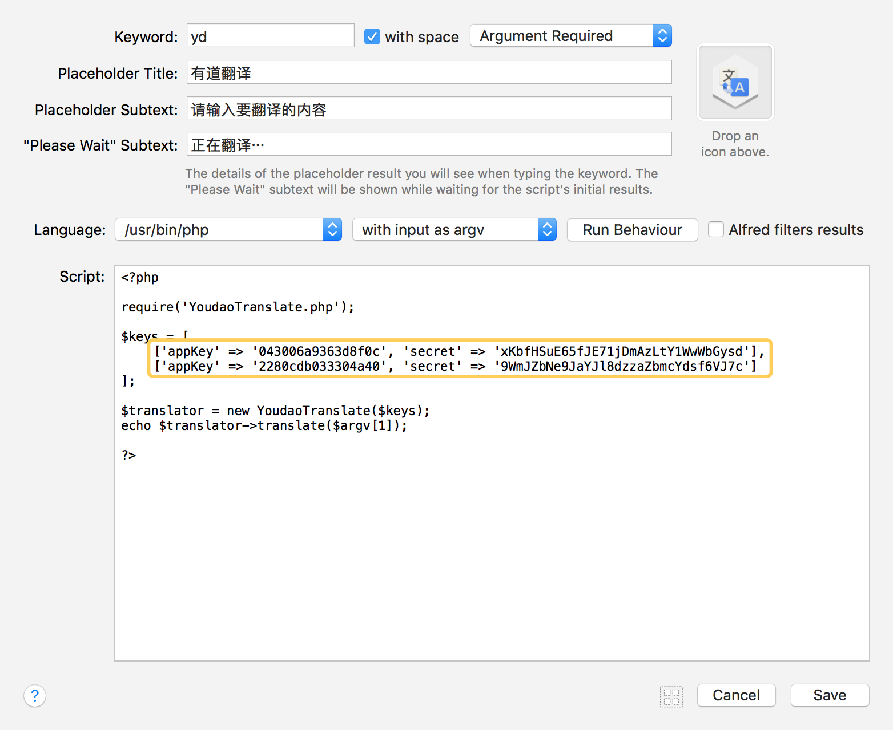
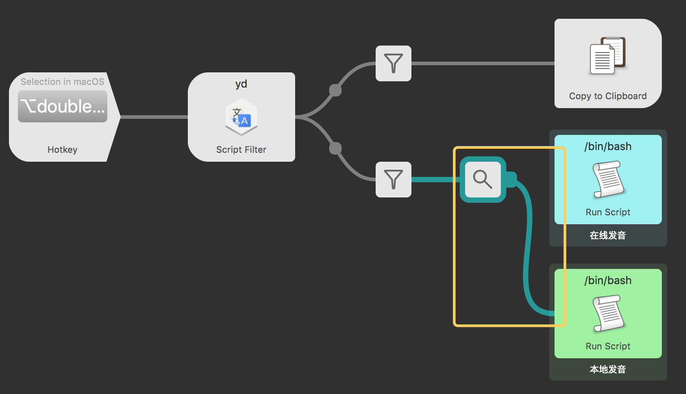

YoudaoTranslate | 有道翻译
===============

### 一、 特性

#### 1. 中英文互翻

#### 2. 在音标上回车可以播放发音

#### 3. 在选项上回车可以复制翻译结果

#### 4. 翻译结果上按 `Shift` 可以直接预览有道网页

#### 5. 双击 `option` 键可以翻译选中内容

### 二、 配置KEYS

> 2017年9月3日更新
> 由于有道翻译 api 迁移到了有道智云，所以大家需要去[有道智云](http://ai.youdao.com/)进行注册然后创建应用了。步骤如下：

1. 注册有道智云帐号
2. 创建一个自然语言翻译服务
3. 创建一个应用并绑定第二步创建的服务
4. 这样就可以获得应用(appKey)和密钥(secret)了

### 三、 发音配置
默认是使用有道词典的线上发音，如果网络不好，发音有延迟，可以切换为本地发音。方法很简单，只需要按图所示调整 alfred 数据流就可以了。

### 四、更新日志  

- 2017年9月3日
  - 更新 api 为有道智云（thanks @newle）#12
  - 优化发音，添加了线上发音
  - 添加了双击翻译选中文字的热键
- 2017年1月13日

  - 更新到Alfred3
  - 支持选中音标进行发音
  - 支持shift 预览Youdao网页

- 2016年3月24日

  内置四个api key, 随机调用解决有道每小时1000次调用次数的限制。

#### 五、 使用库

- https://github.com/joetannenbaum/alfred-workflow