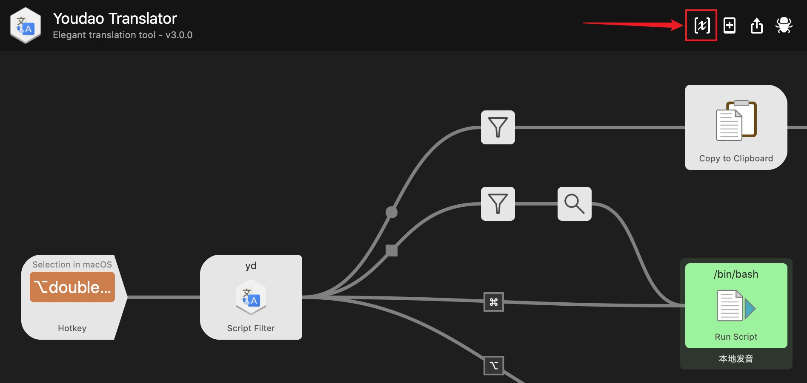
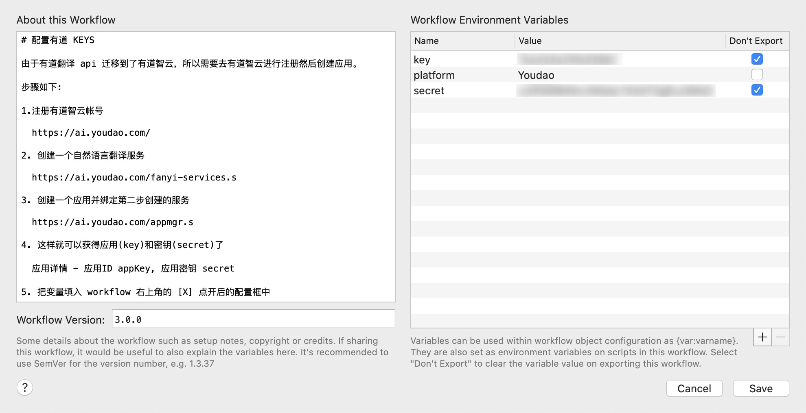

# YoudaoTranslate | 有道翻译  

## ⚠️ V3 更新说明
该版本使用 TS 重构，自带运行环境，不再依赖 PHP。同时支持多个平台的 API。

macOS Monterey 请使用 V3 版本！

标记为施工中 (🚧) 特性 V3 尚未支持，如果需要使用，请切换到 V2 使用。

## 特性
- 🌟 [**无系统环境依赖**]() - 自带 [txiki](https://github.com/saghul/txiki.js) 运行环境，不再需要 PHP
- 🌟 [**多平台支持**]() - 支持百度的翻译API
- 🌐 [**中英文自动互翻**]() - 支持 `CamelCase` 驼峰短语翻译
- 🎭 [**多语言支持**]() - 可以识别中文、英文、日文、韩文、法文、俄文等
- 🎹 [**快捷键支持**]() - 双击 `⌥ Alt`  直接翻译选中内容
- 📢 [**英文发音**]() - `⌘ Command` + `↩︎ Enter` 本地发音，`⌥ Alt` + `↩︎ Enter`  调用有道在线语音发音
- 🚧 [**有道翻译生词本**]() - 可以将陌生单词假如有道生词本
- 📃 [**回车复制**]() - 在选项上 `↩︎ Enter` 回车复制翻译结果
- 🚧 [**查询历史**]() -  `yd *` 查询最近的翻译记录
- 🚧 [**网页预览**]() - 翻译结果上按 `⇧ Shift` 直接预览有道网页
- 🚧 [**自动更新**]() - 输入 `update` 检查更新 Workflow

## 🚀 开始使用

- [GitHub Releases 下载](https://github.com/wensonsmith/YoudaoTranslate/releases)
- [又拍云下载 v3.0.0](https://img.seekbetter.me/workflows/Youdao%20Translator-300.zip)， 

## 配置有道翻译

> 2017年9月3日更新
> 由于有道翻译 api 迁移到了有道智云，所以大家需要去[有道智云](http://ai.youdao.com/)进行注册然后创建应用了

1. 注册[有道智云](https://ai.youdao.com/)帐号

2. 创建一个[自然语言翻译服务](https://ai.youdao.com/fanyi-services.s)

3. 创建一个[有道云应用](https://ai.youdao.com/appmgr.s)并绑定第二步创建的服务

4. 这样就可以获得应用(appKey)和密钥(secret)了

   [应用](https://ai.youdao.com/appmgr.s) - 应用详情 - 应用ID appKey, 应用密钥 secret

5. 把变量填入 workflow 右上角的 [X] 点开后的配置框中

6. 如果要使用生词本功能，请填写网易账户。注意网易账户上面是密码，下面是账户

## Contributors

 
 
 

## ~~Buy me a coffee~~ 🍼 冲奶粉!

## 使用库和参考资料

- https://github.com/joetannenbaum/alfred-workflow
- https://www.alfredapp.com/help/workflows/inputs/script-filter/json/
- https://www.alfredapp.com/help/workflows/
