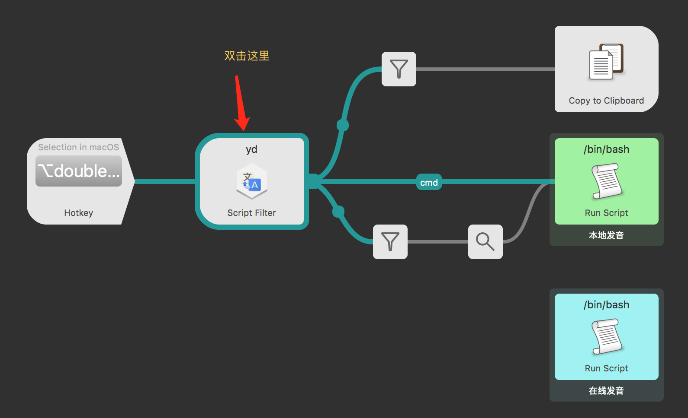
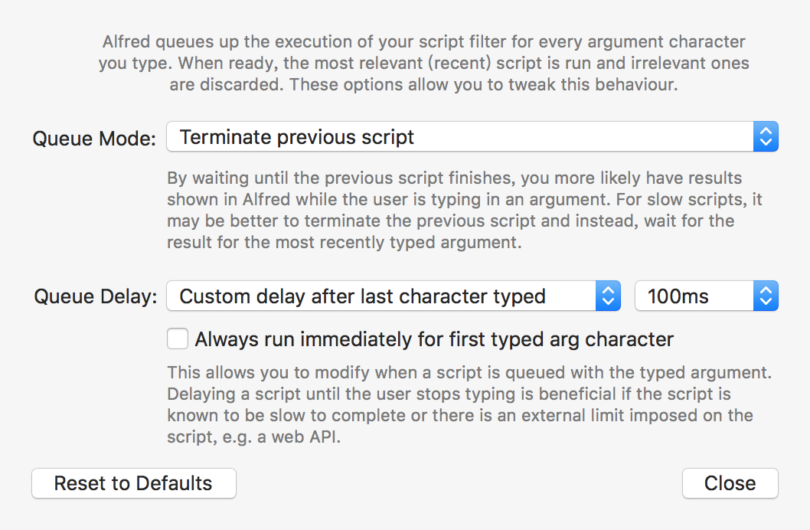

YoudaoTranslate | 有道翻译
===============

## 一、 特性

### 1. 中英文互翻

### 2. 按住`cmd` +`回车` 即可发音,这样不会关闭窗口。在音标上直接回车也可以播放发音并会关闭窗口。

### 3. 输入 `yd *` 可以查询最近的查询记录

### 4. 在选项上回车可以复制翻译结果

### 5. 翻译结果上按 `Shift` 可以直接预览有道网页

### 6. 双击 `option` 键可以翻译选中内容

## 二、下载使用
1. [Github 直接下载](https://github.com/wensonsmith/YoudaoTranslate/raw/master/YoudaoTranslate.alfredworkflow)
1. [百度网盘下载-YoudaoTransalte.alfredworkflow](https://pan.baidu.com/s/1gfu6mkj)

下载后双击导入即可使用。

## 三、推荐设置

## 四、 配置KEYS

> 2017年9月3日更新
> 由于有道翻译 api 迁移到了有道智云，所以大家需要去[有道智云](http://ai.youdao.com/)进行注册然后创建应用了。步骤如下：

1. 注册有道智云帐号
2. 创建一个自然语言翻译服务
3. 创建一个应用并绑定第二步创建的服务
4. 这样就可以获得应用(appKey)和密钥(secret)了

## 五、更新日志  

- 2017年11月19日
  - 优化发音，现在可以按住 `cmd` + `回车` 进行发音 （#17）
  - 增加最近查询记录功能， 输入 `yd *` 可以列出最近查询的 9 个单词 （#10， #16）

- 2017年9月3日
  - 更新 api 为有道智云（thanks @newle）#12
  - 优化发音，添加了线上发音
  - 添加了双击翻译选中文字的热键
- 2017年1月13日

  - 更新到Alfred3
  - 支持选中音标进行发音
  - 支持shift 预览Youdao网页

- 2016年3月24日

  内置四个api key, 随机调用解决有道每小时1000次调用次数的限制。

### 六、 使用库和参考资料

- https://github.com/joetannenbaum/alfred-workflow
- https://www.alfredapp.com/help/workflows/inputs/