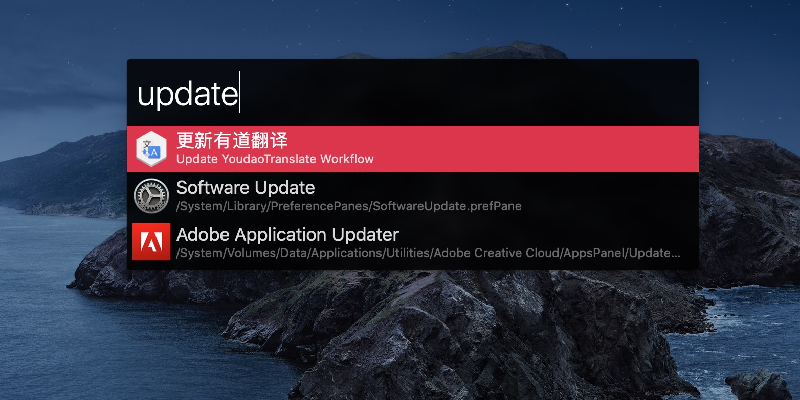
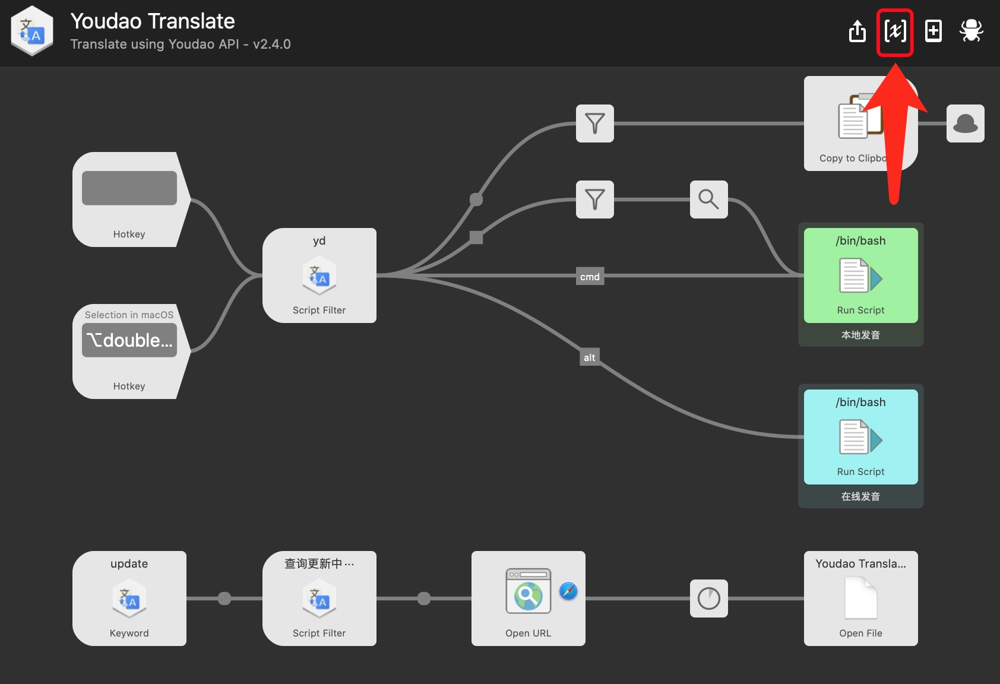
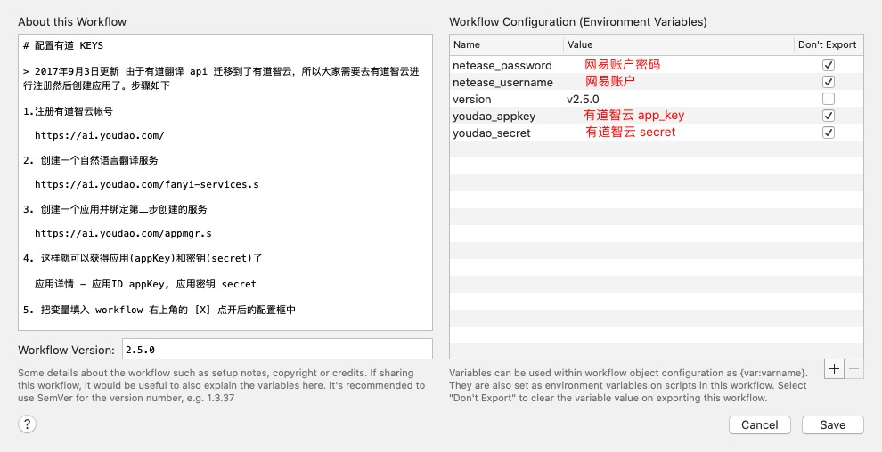

YoudaoTranslate | 有道翻译  <div style="float:right"> </div>
===============


## 一、 特性

#### 1. 中英文自动互翻

支持 `CamelCase` 驼峰短语翻译

#### 2. 多语言支持
可以识别中文、英文、日文、韩文、法文、西班牙文、葡萄牙文、俄文、越南文、德文、阿拉伯文、印尼文、意大利文，其他语种无法识别


#### 3. 快捷键支持
- 双击 `⌥ Alt`  可以翻译选中内容 (在 Hotkey 中设置)

- `⇧ Shift` + `Space` 可以直接唤出翻译输入框(在 Hotkey 中设置)

#### 4. 英文发音
-  `⌘ Command` + `↩︎ Enter` 本地发音（系统 `Say` 命令）
- `⌥ Alt` + `↩︎ Enter`  调用有道在线语音发音
- 在音标上回车发音并关闭窗口


#### 5. 生词本功能
`Ctrl` + `↩︎ Enter` 加入生词本


#### 6. 在选项上 `↩︎ Enter` 回车复制翻译结果

#### 7. `yd *` 查询最近的翻译记录


#### 8. 翻译结果上按 `⇧ Shift` 直接预览有道网页


#### 9. 输入 `update` 检查更新 Workflow



## 二、开始使用

#### 1. 下载导入使用
- [GitHub Releases 下载](https://github.com/wensonsmith/YoudaoTranslate/releases)
- [又拍云下载 v2.6.0](https://img.seekbetter.me/workflows/Youdao%20Translate-260.zip)， v2.6.0 版本以后可以使用 update 进行更新

   下载解压后双击 `Youdao Translate.alfredworkflow` 导入即可使用。

#### 2. 使用源码

```shell
$ git clone https://github.com/wensonsmith/YoudaoTranslate.git /path/to/YoudaoTranslate
// 请注意这里是 Alfred 3 的路径
$ ln -s /path/to/YoudaoTranslate/src/ ~/Library/Application\ Support/Alfred\ 3/Alfred.alfredpreferences/workflows/YoudaoTranslate
```
以后只需要进入 `/path/to/YoudaoTranslate` 进行 `git pull` 即可更新

## 三、 配置有道翻译

> 2017年9月3日更新
> 由于有道翻译 api 迁移到了有道智云，所以大家需要去[有道智云](http://ai.youdao.com/)进行注册然后创建应用了

1. 注册[有道智云](https://ai.youdao.com/)帐号

2. 创建一个[自然语言翻译服务](https://ai.youdao.com/fanyi-services.s)

3. 创建一个[有道云应用](https://ai.youdao.com/appmgr.s)并绑定第二步创建的服务

4. 这样就可以获得应用(appKey)和密钥(secret)了

   [应用](https://ai.youdao.com/appmgr.s) - 应用详情 - 应用ID appKey, 应用密钥 secret

5. 把变量填入 workflow 右上角的 [X] 点开后的配置框中




6. 如果要使用生词本功能，请填写网易账户。注意网易账户上面是密码，下面是账户




## 四、Contributors

<a href="https://iwenson.com" target="_blank"></a> 
<a href="https://blog.zthxxx.me" target="_blank"></a> 
<a href="https://www.zzaning.com/#/" target="_blank"></a> 

## 五、~~Buy me a coffee~~ 🍼冲奶粉
!

## 六、 使用库和参考资料

- https://github.com/joetannenbaum/alfred-workflow
- https://www.alfredapp.com/help/workflows/inputs/script-filter/json/
- https://www.alfredapp.com/help/workflows/
