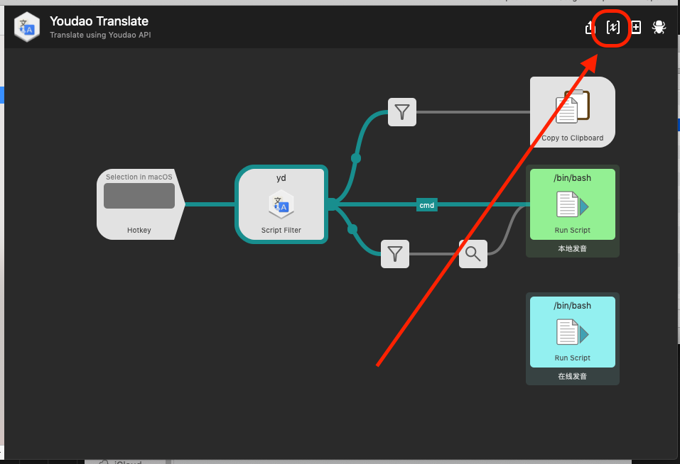
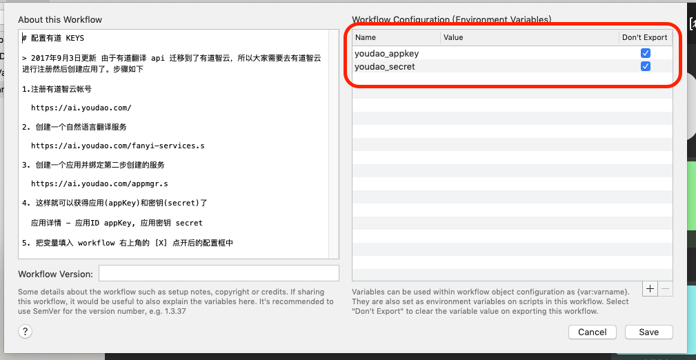

YoudaoTranslate | 有道翻译
===============


## 一、 特性

### 1. 中英文互翻自动判断

### 2. Hotkey 常用

- 快捷键双击 `⌥` (可以在 Hotkey 中修改)可以翻译选中内容

- 按 `⌃` + `space` 可以直接唤出翻译输入框，方便直接手动输入

### 3. 按住 `⌘`+`↩︎`  即可发音 (使用系统自带的 say)，这样不会关闭窗口。在音标上直接回车也可以播放发音并会关闭窗口。

按住  `⌥`+`↩︎`  也能发音，调用有道语音 api，速度会慢一点；两者口音不一样。


### 4. 在选项上`↩︎`回车可以复制翻译结果

### 5. 输入 `yd *` 可以查询最近的查询记录


### 6. 翻译结果上按 `⇧(Shift)` 可以直接预览有道网页


## 二、下载使用
1. [GitHub Releases 直接下载](https://github.com/wensonsmith/YoudaoTranslate/releases)

   下载解压后双击 `Youdao Translate.alfredworkflow` 导入即可使用。

1. 把 GitHub 项目中 src 目录内容下载到 `~/Library/Application Support/Alfred 3/Alfred.alfredpreferences/workflows` 目录
   可用的一键脚本：

   ```bash
   workflows="${HOME}/Library/Application Support/Alfred 3/Alfred.alfredpreferences/workflows/"
   mkdir -p "${workflows}/YoudaoTranslate"
   curl https://codeload.github.com/wensonsmith/YoudaoTranslate/tar.gz/master | \
     tar -xz \
       -C "${workflows}/YoudaoTranslate" \
       --strip=2 YoudaoTranslate-master/src
   
   ```

   


## 三、推荐设置

Hotkey 设置为 `Double ⌥`


## 四、 配置有道翻译 API KEYS

> 2017年9月3日更新
> 由于有道翻译 api 迁移到了有道智云，所以大家需要去[有道智云](http://ai.youdao.com/)进行注册然后创建应用了。步骤如下：

1. 注册[有道智云](https://ai.youdao.com/)帐号

2. 创建一个[自然语言翻译服务](https://ai.youdao.com/fanyi-services.s)

3. 创建一个[有道云应用](https://ai.youdao.com/appmgr.s)并绑定第二步创建的服务

4. 这样就可以获得应用(appKey)和密钥(secret)了

   [应用](https://ai.youdao.com/appmgr.s) - 应用详情 - 应用ID appKey, 应用密钥 secret

5. 把变量填入 workflow 右上角的 [X] 点开后的配置框中







## 五、更新日志  

- 2019年11月12日
  
  - 修复有道 Api 更新造成的没有单词字典详细释义的问题
  - 更新 Readme (修复文案按键、增加下载命令)
  
- 2019年8月27日
  
  - 增加发音快捷键 (`⌥`)、优化单词复制过滤正则 (如 ~【数】【动】等)

- 2019年8月23日
  
  - 使用 [alfred 自带 variables](https://www.alfredapp.com/help/workflows/advanced/variables/) 功能配置有道 API Keys

- 2019年8月22日
  
  - 修复中译英时，每项选中 Enter 时直接复制内容为对应不同项翻译，而非固定第一项翻译
  
- 英译中时，固定第一项 选中内容 为英语原文，cmd + Enter 可以直接发音
  
- 2017年11月19日
  
  - 优化发音，现在可以按住 `⌘`+`↩︎` 进行发音 （#17）
  
- 增加最近查询记录功能， 输入 `yd *` 可以列出最近查询的 9 个单词 （#10， #16）
  
- 2017年9月3日
  
  - 更新 api 为有道智云（thanks @newle）#12
  - 优化发音，添加了线上发音
  - 添加了双击翻译选中文字的热键
  
- 2017年1月13日

  - 更新到Alfred3
  - 支持选中音标进行发音
  - 支持shift 预览Youdao网页

- 2016年3月24日

  内置四个api key, 随机调用解决有道每小时1000次调用次数的限制。

### 六、 使用库和参考资料

- https://github.com/joetannenbaum/alfred-workflow
- https://www.alfredapp.com/help/workflows/inputs/
- https://www.alfredapp.com/help/workflows/advanced/variables/